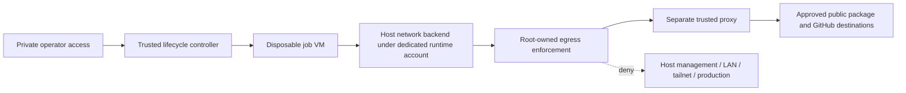

# External network isolation: design and acceptance gates

Status: proposed enforcement design, not installed or certified. Keep GitHub registration disabled until the live acceptance matrix passes. The current pilot is suitable for trusted lifecycle probes only.

## Why a second enforcement layer is needed

An isolated filesystem does not restrict network reachability. Lima's user-mode network provides a guest-to-host gateway. Its VZ implementation starts a host-side gvisor-tap-vsock network stack; a firewall inside the job VM can be changed by guest root. [Lima networking](https://lima-vm.io/docs/config/network/user/), [pinned VZ implementation](https://github.com/lima-vm/lima/blob/v2.2.0/pkg/driver/vz/vm_darwin.go)

Do not add a gateway NIC and assume the default path disappeared. Inspect every effective NIC, IPv4/IPv6 route, host alias and DNS path. Tailscale policies govern traffic through Tailscale; they do not replace guest-to-host or home-LAN restrictions.

## First candidate to validate

Use a dedicated non-admin macOS account for the disposable VM runtime. Give it no personal files, shared project mounts, central deployment secrets or login access. Keep existing service VMs under their current account. Root owns enforcement and startup policy; the VM runtime cannot edit either.

The candidate is a scoped host PF ruleset denying runtime-originated traffic except an explicitly allowed proxy path, with a separate trusted proxy handling approved public HTTPS destinations. macOS socket/user attribution, rule ordering, loopback handling and VZ traffic paths must be proven on the target machine. **Do not deploy this design merely because a PF file parses.** If any traffic escapes attribution, reject this candidate and use a truly isolated virtual network with an external gateway, or keep those jobs hosted.

Start with a deny-all proof before allowing the proxy. Fail closed when enforcement, proxy or the watchdog is absent. Proxy environment variables are configuration hints; they are not enforcement because code can ignore them.

For the proxy phase, allow explicit destination names/ports from the private installation config. Resolve and validate addresses on the trusted side and connect to the validated address; reject private, loopback, link-local, multicast and special-use destinations, including IPv4-mapped IPv6. Recheck DNS changes. Deny direct connections, arbitrary DNS, QUIC and proxy tunnelling to unapproved destinations. Keep production endpoints explicitly excluded, including publicly addressed production systems.

An HTTPS destination allowlist cannot stop all exfiltration to an allowed multi-tenant service. Do not give job code production secrets. Broad wildcards and generic HTTPS CONNECT access do not satisfy this design. Avoid TLS interception as an incidental step; it introduces certificates and additional trust requirements.

## Live acceptance matrix

Use owned synthetic listeners and canaries. Do not probe production write endpoints or scan the LAN.

| Test | Required observation |
|---|---|
| Approved registry/GitHub endpoint | Works only through the approved path |
| Direct public IPv4/IPv6 | Denied outside that path |
| Host gateway, host aliases, host LAN/tailnet addresses | Cannot reach synthetic host listener or management port |
| Loopback mappings and existing forwarded service ports | No route to host administrative/service endpoints |
| Owned LAN/tailnet canary | Denied, with corroborating enforcement evidence |
| Production destination policy | Denied without sending a production request; test an equivalent owned canary |
| Arbitrary DNS / DNS-over-HTTPS / QUIC | No bypass outside approved destinations; document residual allowed-service risk |
| Allowed hostname resolving to private/special-use addresses | Denied after resolution; DNS rebinding cannot reopen it |
| Guest root flushes firewall or changes routes | Host-enforced denial still holds |
| Additional NIC / alternate default route | Admission refuses the modified profile |
| Proxy down or enforcement missing | Workload admission fails closed; no direct fallback |
| Host reboot / controller crash / cancelled job | No workload starts before enforcement and cleanup reconciliation |
| Existing services and private operator SSH | Continue working through their original paths |

Capture effective rules, rule counters, resolved addresses, VM/image identity, tool versions and positive-control reachability with each result. A timeout alone is not proof: the test destination might be down. Store real inventories and reports privately.

## Privileged installation boundary

Do not modify an existing user's broad egress policy, flush the main PF ruleset, reuse Apple's anchor namespace, kill unrelated PF states, disable Tailscale or change router forwarding. Prepare a separately named anchor, exact account identity, scoped rollback and local-console recovery before privileged installation. Account creation and root-owned enforcement require an authorized administrator on macOS; do not request passwords in chat or grant broad passwordless sudo.

The operator must review the generated account/firewall/proxy/startup bundle before installation. That bundle is not implemented yet; this design is not an instruction to run ad hoc PF commands. Root-owned binary/config paths and update behavior need review before moving a Homebrew-managed runtime into a dedicated service account.
